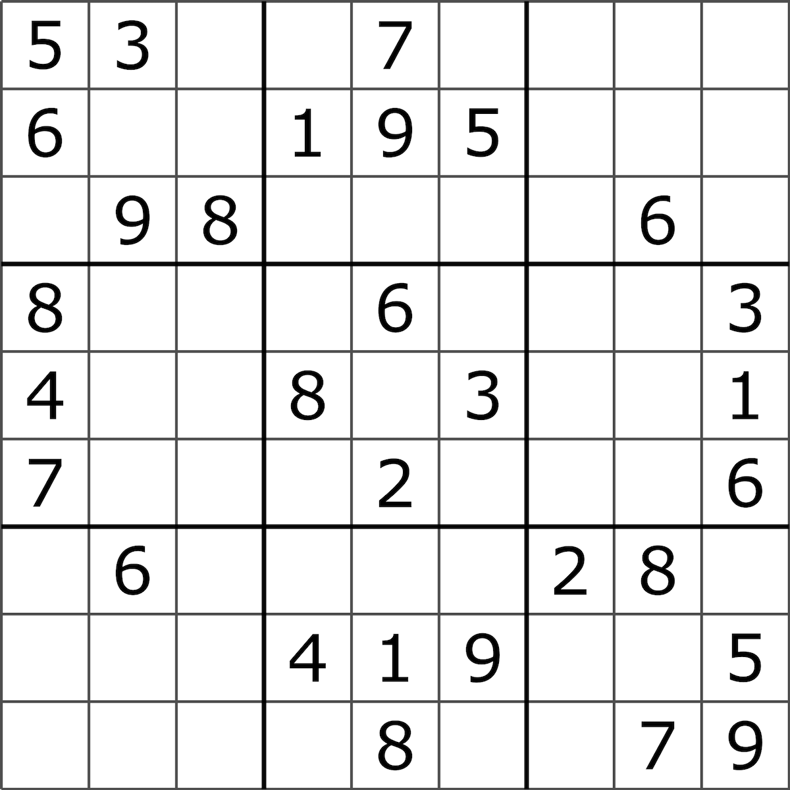

```{r setup, include=FALSE}
knitr::opts_chunk$set(cache = TRUE, warning = FALSE, message = FALSE, 
                      echo = TRUE, dpi = 300, cache.lazy = FALSE,
                      fig.width = 8, fig.height = 7)
```

Coming off of the wild excursion of getting Python markdown through RStudio's knitr (which didnt really work out well... I just exported a Jupyter Lab markdown and arranged it through my Hugo build), this is a brief vantage of how we might write the sudoku puzzle solver in the R language. Here we go. 

Using the basic sudoku puzzle from wikipedia [HERE](https://en.wikipedia.org/wiki/Sudoku), we'll start to build this out. 

```{r echo=FALSE, fig.align = 'center', fig.link='https://en.wikipedia.org/wiki/Sudoku'}
 
```

Using the same input methods as the python version ([here](https://www.mldebusklane.com/post/random_code/sudoku/))
